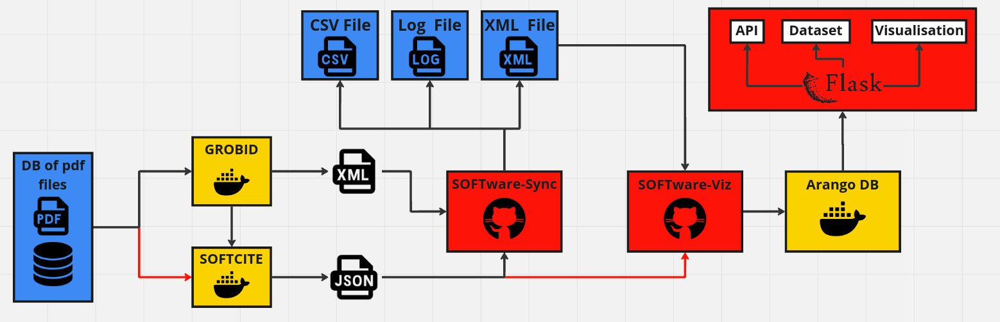

<div style="text-align: center;margin-bottom: 20px;">
  
</div>

<div style="text-align: center;margin-bottom: 20px;">
	
	
	
	
    
    
</div>

## Présentation du projet

**SOFTware-HUB** ne fonctionne que sur LINUX.

L'objectif est de permettre de lancer le pipeline SOFTware automatiquement.



Le projet comprend 3 scripts bash et 1 script python.

**SOFTware-Hube** s'occupe de lancer les trois docker nécessaire au bon fonctionnement du pipeline (et de supprimer les containers en trop).

## Prérequis

Installer les dépendances du Hub:

```code
pip install -r requirements.txt
```

Concernant les prérequis il faudra manuellement installer les 4 applications suivante:

* [SOFTware-Viz](https://github.com/Samuel-Scalbert/SOFTware-Viz) ou la version Light: [SOFTware-Viz-Light](https://github.com/Samuel-Scalbert/SOFTware-Viz-Light)
* [SOFTware-Sync](https://github.com/Samuel-Scalbert/SOFTware-Sync) 
* [Grobid CLIENT](https://github.com/kermitt2/grobid_client_python)
* [Softcite CLIENT](https://github.com/softcite/software_mentions_client)

Il est fortement conseillé de les installer dans le même dossier au même niveau que cette application de cette manière:

```aiignore
├── SOFTware
│   ├── grobid_client_python
│   ├── SOFTware-Hub
│   ├── software_mentions_client
│   ├── SOFTware-Sync 
│   └── SOFTware-Viz
```

Si vous souhaitez changer les positions des applications il est possible de modifier le fichier config.json (il est aussi possible de changer la version des images Docker si vous en avez besoin):

```aiignore
├── SOFTware-Hub
│   ├── ...
│   └── config.json
```

## Lancement de l'application

### DATA CREATOR

le premier script a lancer va seulement créer un dossier ../data avec tous les sous dossiers nécessaire.

```console
./DATA_CREATOR.sh
```

Il faut ensuite insérer vos PDF dans le dossier :

```aiignore
├── data
│   ├── json_files
│   ├── pdf_files (<---- ici)
│   ├── xml_files
│   ├── xml_grobid
│   └── xml_meta
```

### DATA PROCESSOR

Pour ensuite process toute cette données il faut d'abord lancer le script qui s'occupe de check les dockers et les environment virtuel/installation des github:

```console
python main.py
```

le résultat :

```console
(venv) sscalber@ss-inria:~/Bureau/SOFTware/SOFTware-Hub$ python main.py
Application check completed.

    ┏┓┏┓┏┓┏┳┓           ┓┏  ┓ 
    ┗┓┃┃┣  ┃ ┓┏┏┏┓┏┓┏┓━━┣┫┓┏┣┓
    ┗┛┗┛┻  ┻ ┗┻┛┗┻┛ ┗   ┛┗┗┻┗┛                      
    
Checking (image): grobid/grobid:0.8.0
    grobid/grobid:0.8.0                                available
Checking (image): grobid/software-mentions:0.8.0
    grobid/software-mentions:0.8.0                     available
nvidia-smi not found. No NVIDIA GPU is available or the NVIDIA drivers are not installed.
Kept container: 'priceless_wu' running with image grobid/grobid:0.8.0 on port :{'8070/tcp': [{'HostIp': '0.0.0.0', 'HostPort': '8070'}, {'HostIp': '::', 'HostPort': '8070'}]}
Kept container: 'dazzling_morse' running with image grobid/software-mentions:0.8.0 on port :{'8060/tcp': [{'HostIp': '0.0.0.0', 'HostPort': '8060'}, {'HostIp': '::', 'HostPort': '8060'}]}
---------------------------------------------
Checking application: Grobid_client
  Verifying repository path: ../grobid_client_python
    Repository path exists
---------------------------------------------
Checking application: Softcite_client
  Verifying repository path: ../software_mentions_client
    Repository path exists
  Checking for virtual environment: ../software_mentions_client/venv
    venv folder found
---------------------------------------------
Checking application: SOFTware-Sync
  Verifying repository path: ../SOFTware-Sync
    Repository path exists
  Checking for virtual environment: ../SOFTware-Sync/venv
    venv folder found
---------------------------------------------
Checking application: SOFTware-Viz
  Verifying repository path: ../SOFTware-Sync
    Repository path exists
  Checking for virtual environment: ../SOFTware-Sync/venv
    venv folder found
```

Enfin il faut lancer le script pour process les pdf:

```console
./DATA_PROCESSOR.sh
```

le résultat:

```console
(venv) sscalber@ss-inria:~/Bureau/SOFTware/SOFTware-Hub$ ./DATA_PROCESSOR.sh
Installing Grobid Client...
Running Grobid Client
GROBID server is up and running
runtime: 60.102 seconds 
Are you satisfied with the Grobid result? (y/n): y
Proceeding with the next step.
Organizing XML files...
Activating virtual environment for Software Mentions Client...
Running Software Mentions Client...
logs are written in client.log
total process: 5 - accumulated runtime: 71.806 s - 0.07 files/s  
---
total entries: 7
---
total successfully processed: 7
---
total failed: 0
---
Are you satisfied with the Software Mentions Client result? (y/n): y
Proceeding to the end of the pipeline.
```

### DATA VISUALIZER (incoming)
### DATA VISUALIZER LIGHT (incoming)