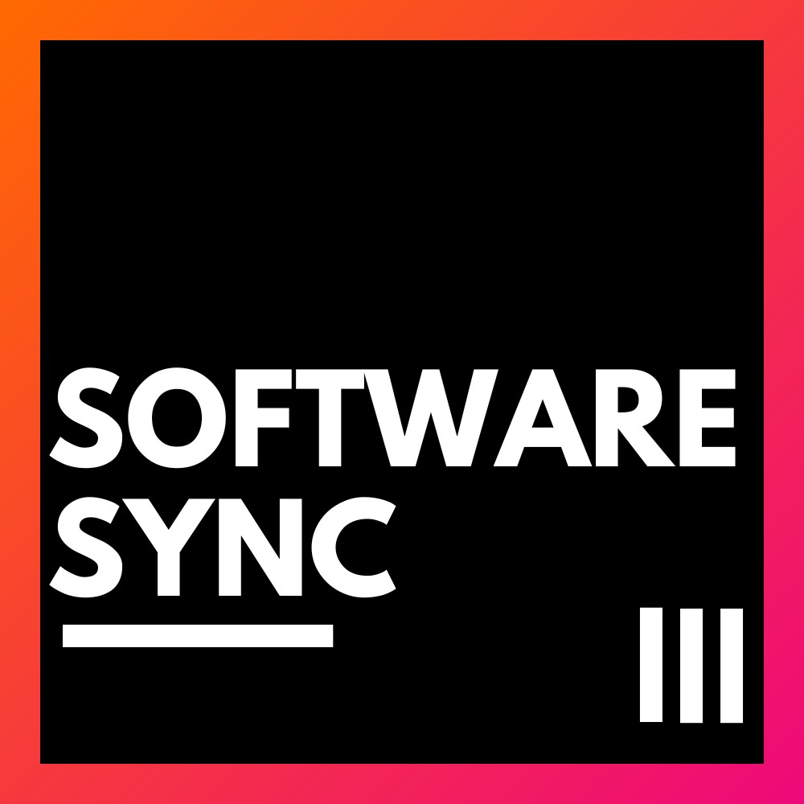
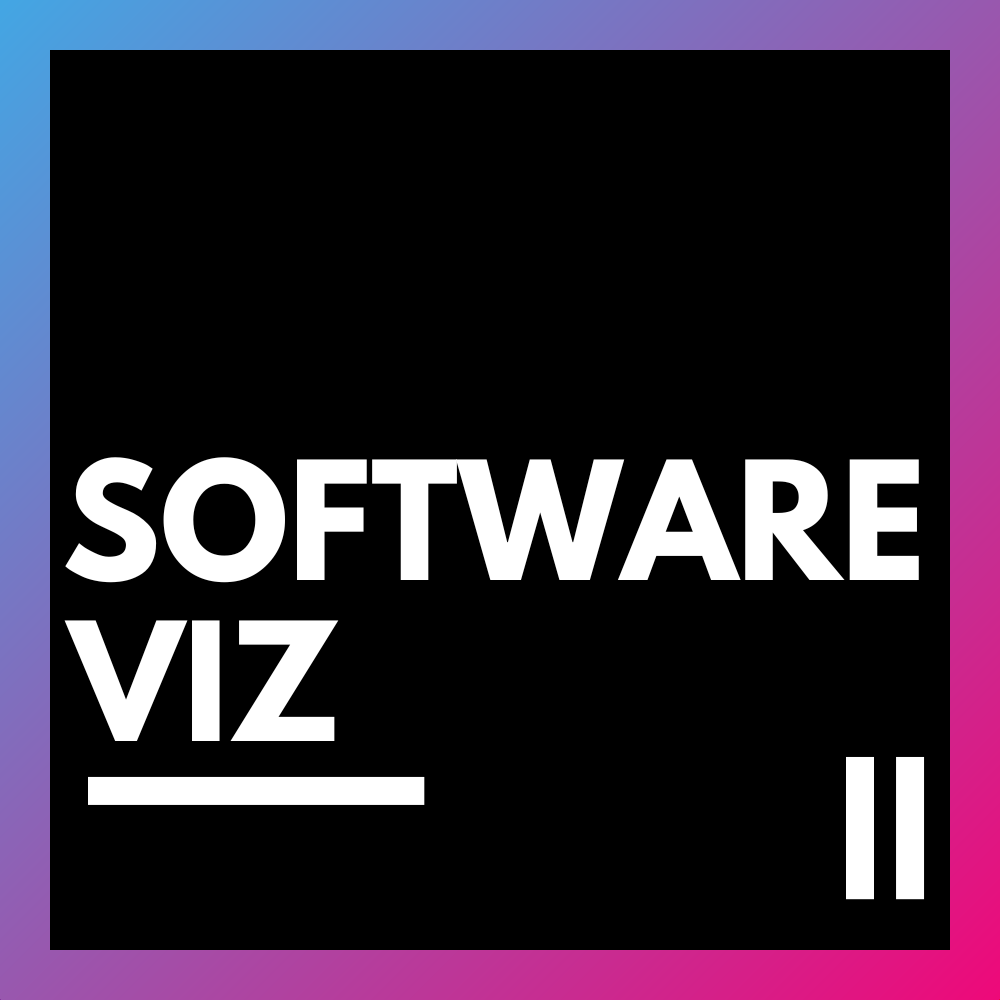
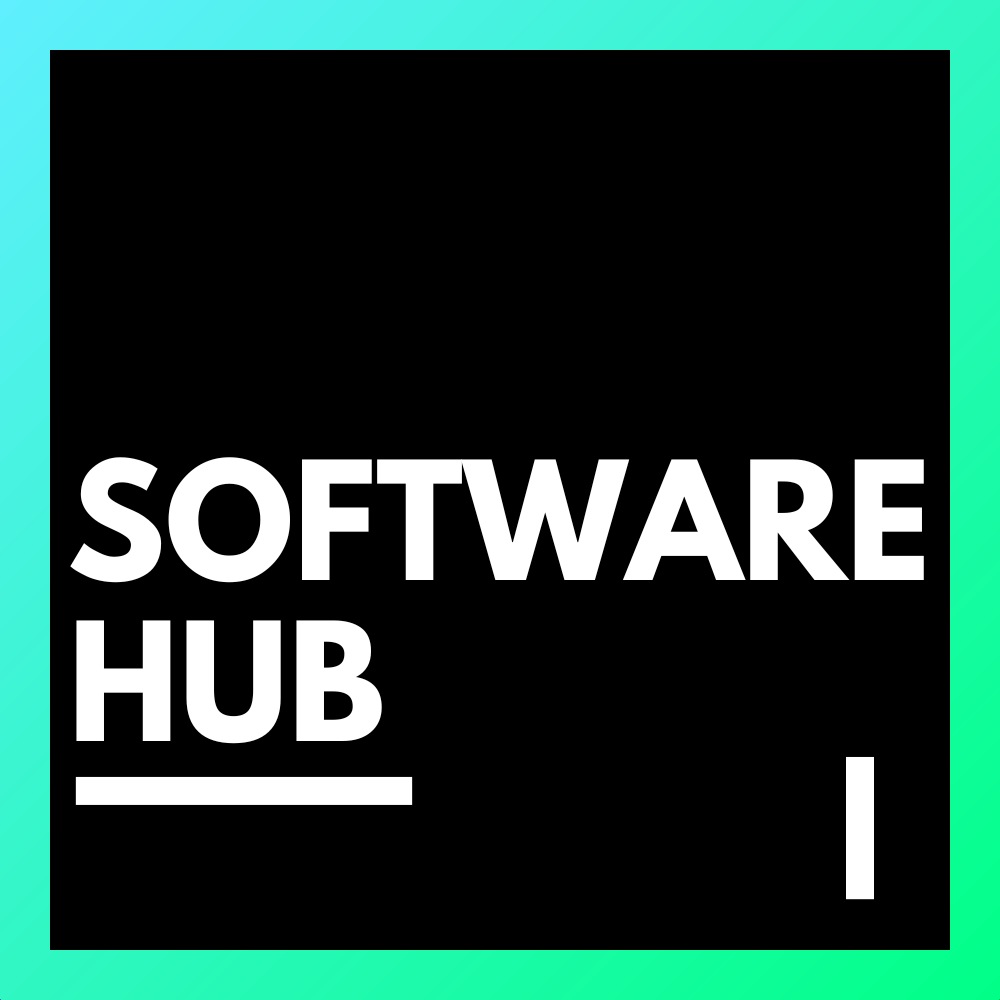
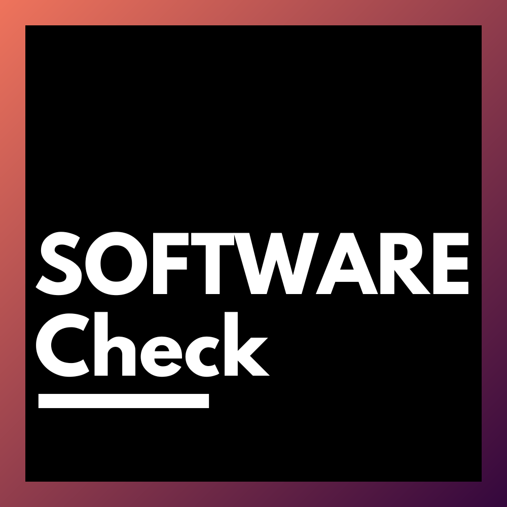
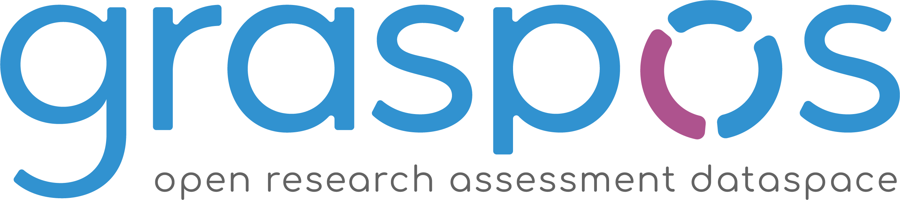
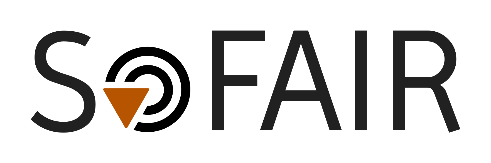

# Documentation du projet SOFTware

  
  
  
  

## Présentation
    
Je suis **Samuel Scalbert** ([LinkedIn](https://www.linkedin.com/in/samuel-scalbert/))
, expert en fouille de données textuelle et documentaire à l'**INRIA**.

Je contribue à plusieurs projets innovants pour transformer la manière dont nous évaluons, partageons et utilisons la recherche scientifique :

  
  
  

- **GRASP-OS** : repenser l’évaluation de la recherche avec des métriques ouvertes et responsables, alignées sur la science ouverte.
- **SoFAIR** : améliorer la découvrabilité et l’archivage des logiciels scientifiques, pour une recherche plus reproductible.
- **Datalake INRIA** : structurer et centraliser toute la production scientifique d’INRIA, en exploitant Grobid et Softcite.
- **Développement de logiciels** : création de quatre logiciels facilitant l’analyse, l’extraction et la gestion des connaissances dans l’écosystème scientifique, dans le cadre du projet **SOFTware**.

Ces projets ont un objectif commun : rendre la recherche plus **ouverte, interopérable et efficace**.

## Objectifs du projet SOFTware

Le projet **SOFTware** vise à développer des outils permettant de :

- **Faciliter l’analyse et l’extraction de connaissances** dans le domaine scientifique.
- **Optimiser la gestion des données** pour les chercheurs et les institutions.
- **Encourager la réutilisation et la reproductibilité** des résultats scientifiques grâce à des solutions open source.

## Genèse du projet

Au fil de mes recherches, j’ai développé des outils pour **faciliter et monitorer mes résultats et expériences**. Initialement conçus pour un usage personnel, ces applications ont suscité l’intérêt de mes collègues. Afin de les rendre accessibles et utilisables par tous, j’ai décidé d’adopter une approche **open source**.

**Tous les logiciels développés dans le cadre du projet SOFTware sont des Proof of Concept (POC).**

## Licence et contributions

Le projet **SOFTware** est entièrement **open source**. Toute contribution est la bienvenue !

- Pour signaler un bug ou proposer une amélioration, ouvrez une **issue**.
- Pour contribuer au code, soumettez une **pull request**.

## Contact

Si vous souhaitez en savoir plus ou collaborer sur ce projet, n’hésitez pas à me contacter :

📧 **[Samuel Scalbert](mailto:samuel.scalbert@inria.fr)**  
🔗 **[Linkedin](https://www.linkedin.com/in/samuel-scalbert/)** 
