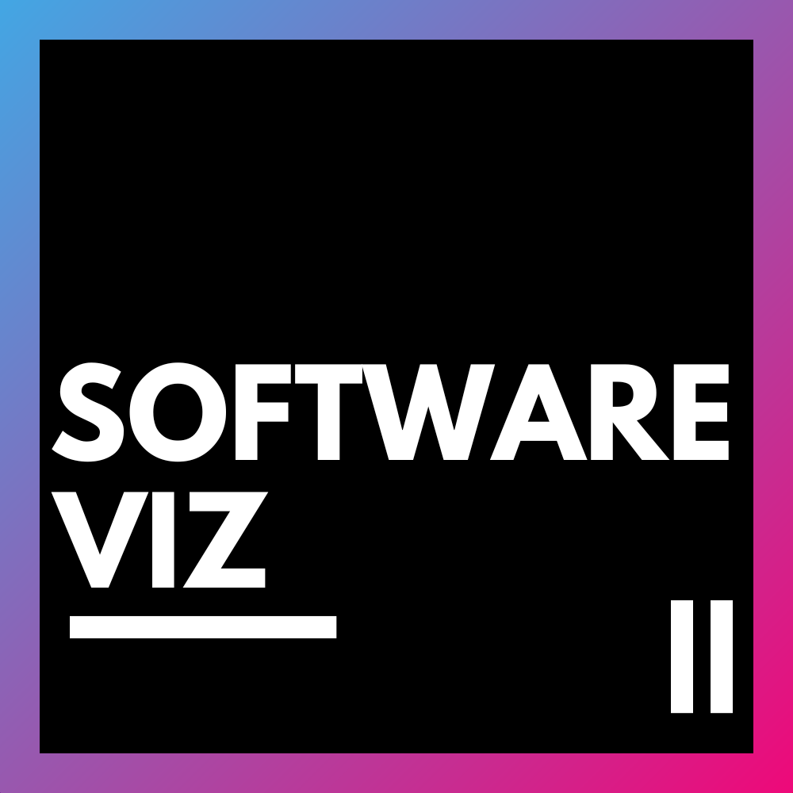

<div style="text-align: center;margin-bottom: 20px;">
  
</div>

<div style="text-align: center;margin-bottom: 20px;">
	
	
	
	
    
    
</div>

## Présentation du projet

🛑 Cette version de SOFTware-Viz est la version universelle qui fonctionne avec tous les fichiers PDF et sans connexion à HAL INRIA.

🛑 Si vous utilisez des fichiers de HAL, vous devez utiliser la version originale [SOFTware-Viz](https://github.com/Samuel-Scalbert/SOFTware-Viz).

### Base de données de PDF
Le processus commence avec une base de données de fichiers **PDF** académiques qui doivent être extraits et traités.

### GROBID
Les fichiers **PDF** sont envoyés à **GROBID**, un outil permettant d’extraire des données structurées (comme des informations bibliographiques) à partir de **PDF** académiques. **GROBID** génère en sortie des fichiers **XML**, rendant l’information lisible par machine.

### SOFTCITE
Après **GROBID**, les données extraites sont transmises à **SOFTCITE**, qui génère des fichiers **JSON**. **SOFTCITE** analyse les citations, les mentions de logiciels ou d’autres informations de référence présentes dans les **PDF**.

### SOFTware-Sync
Les fichiers **XML** et **JSON** extraits sont ensuite traités par **SOFTware-Sync**, un outil qui synchronise ces données dans un fichier **XML** unique.

### SOFTware-Viz
**SOFTware-Viz** est chargé de la visualisation des données traitées. Il prend les données synchronisées par **SOFTware-Sync** et les transforme en **tableaux de bord** ou autres représentations graphiques.

### ArangoDB
Les données traitées sont stockées dans **ArangoDB**, une base de données **NoSQL multi-modèle**, permettant la gestion des données structurées. Elle sert de stockage principal pour les informations et mentions extraites.

### Flask
**Flask** est un framework web utilisé pour développer des applications web. Il interagit avec **SOFTware-Viz** (pour la visualisation) et **ArangoDB** (pour la récupération des données).

---

## Installation

#### Depuis `la source`

* Clonez le dépôt :<br>
```console
git clone ../
```
* Accédez au répertoire du projet :<br>
```console
cd ./SOFTware-viz
```
* Créez un environnement virtuel :<br>
```console
python -m venv env
```
* Installez l’image **Docker** :<br>
```console
docker pull arangodb/arangodb:3.11.6
```
* Lancez un conteneur **Docker** :<br>
```console
docker run -p 8529:8529 -e ARANGO_NO_AUTH=1 arangodb/arangodb:3.11.6
```
* Activez l’environnement virtuel :<br>
```console
source env/bin/activate
```
* Installez les dépendances :<br>
```console
pip install -r requirement.txt
```
* Insérez les fichiers XML dans le dossier ./app/static/data/xml_files et les json dans app/static/data/json_files :<br>
<br>
* Lancez l’application :    
```console
python run.py
```
---

## Utilisation

#### Depuis `la source`

Exécutez l’application avec la commande suivante (**la base de données se créera automatiquement lors du premier lancement**) :

```
python run.py
```